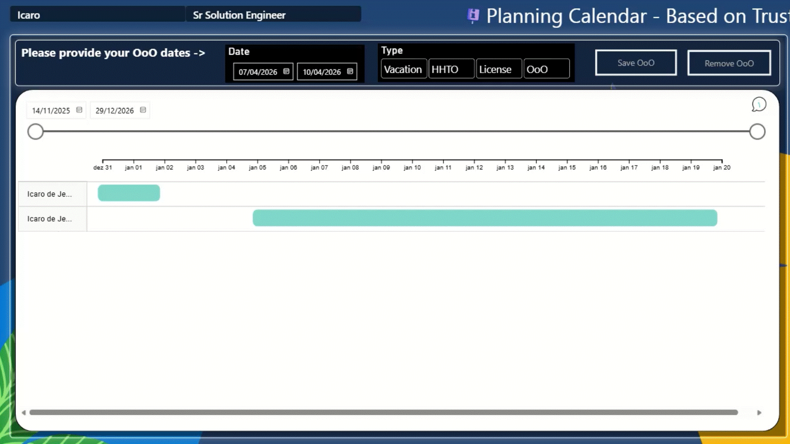

# 📅 Interactive Absence Dashboard | Dashboard Interativo de Ausências

> **Microsoft Fabric User Data Functions + Power BI**



---

## 🇺🇸 English

An interactive calendar dashboard for managing team absences, built with **Microsoft Fabric User Data Functions** and **Power BI**.

### Features

- **Insert & delete** absence records directly from the Power BI dashboard
- **Real-time updates** via Direct Query on the fact table
- **Row Level Security (RLS)** — each user sees only their team's data
- **Serverless Python functions** hosted in Fabric (no infrastructure to manage)

### How it works

```
Power BI Button → User Data Function (Python) → Fabric Warehouse
```

### 📖 Full Documentation

👉 [**Read the step-by-step guide in English**](en-us.md)

---

## 🇧🇷 Português

Um dashboard de calendário interativo para gerenciar ausências da equipe, construído com **Funções de Dados do Usuário do Microsoft Fabric** e **Power BI**.

### Funcionalidades

- **Inserir e deletar** registros de ausência diretamente pelo dashboard do Power BI
- **Atualizações em tempo real** via Direct Query na tabela fato
- **Row Level Security (RLS)** — cada usuário visualiza apenas os dados do seu time
- **Funções Python serverless** hospedadas no Fabric (sem infraestrutura para gerenciar)

### Como funciona

```
Botão no Power BI → Função de Dados do Usuário (Python) → Warehouse do Fabric
```

### 📖 Documentação Completa

👉 [**Leia o guia passo a passo em Português**](pt-br.md)

---

## 📁 Repository Structure | Estrutura do Repositório

```
├── README.md                          # This file | Este arquivo
├── en-us.md                           # Full tutorial (English)
├── pt-br.md                           # Tutorial completo (Português)
├── Codes/
│   ├── data_function_en-us.py         # Documented code (English)
│   └── data_function_pt-br.py         # Código documentado (Português)
├── pbi_file/
│   └── OoO_Dash.pbix                  # Power BI dashboard file
├── images/                            # Screenshots & GIFs
└── SQL Queries/                       # SQL scripts
```

---

## ⚙️ Prerequisites | Pré-requisitos

| Requirement | Requisito | Link |
|-------------|-----------|------|
| Active Fabric capacity | Capacidade ativa do Fabric | [Docs](https://learn.microsoft.com/en-us/fabric/enterprise/buy-subscription) |
| Workspace linked to capacity | Workspace vinculado à capacidade | [Docs](https://learn.microsoft.com/en-us/fabric/fundamentals/create-workspaces) |

---

## 📥 Quick Start | Início Rápido

1. Download the [OoO_Dash.pbix](pbi_file/OoO_Dash.pbix) file
2. Follow the documentation in your preferred language above
3. Configure connections and publish

---

*Built by Microsoft Brazil* 🇧🇷
