# 📅 Dashboard Interativo de Ausências com Microsoft Fabric + Power BI

> Como a Microsoft Brasil está usando o Fabric para desenvolvimento de aplicações de dados.

## Sobre o Projeto

Este repositório demonstra como utilizar as **Funções de Dados do Usuário (User Data Functions)** do Microsoft Fabric integradas ao **Power BI** para criar um dashboard interativo de calendário para controle de ausências dentro de uma equipe.


---

## Pré-requisitos

| Requisito | Documentação |
|-----------|--------------|
| Capacidade do Fabric ativa | [Como adquirir](https://learn.microsoft.com/pt-br/fabric/enterprise/buy-subscription) |
| Workspace criado e atrelado à capacidade | [Criar workspaces](https://learn.microsoft.com/pt-br/fabric/fundamentals/create-workspaces) |

---

## Sumário

1. [Criação do Warehouse](#etapa-1---criação-do-warehouse)
2. [Criação das Funções de Dados do Usuário](#etapa-2---criação-das-funções-de-dados-do-usuário-fdu)
3. [Teste das Funções](#etapa-3---teste-das-funções)
4. [Publicação da Função](#etapa-4---publicação-da-função)
5. [Conexão das bases com o Power BI](#etapa-5---conexão-das-bases-com-o-power-bi)
6. [Conectar Função com o Power BI](#etapa-6---conectar-função-de-dados-do-usuário-com-o-power-bi)
7. [Modelo de Dados](#etapa-7---modelo-de-dados)
8. [Publicação do Dashboard](#etapa-8---publicação-do-dashboard)
9. [Atualização dos dados Import via Pipeline](#etapa-9---atualização-dos-dados-no-formato-import)

---

## Etapa 1 - Criação do Warehouse

O Warehouse será necessário para hospedar os dados do Power BI e também será utilizado como local onde as funções do Fabric irão se conectar para fazer modificações nos dados.

Para criação do Warehouse, dentro do workspace do Fabric:

> **Fabric Workspace** → **Novo Item** → **Warehouse**

Com o banco criado, será necessário criar 3 tabelas:
- Uma tabela com informações dos funcionários da empresa
- Uma tabela fato para as informações de ausências
- Uma tabela dimensão para resumir os tipos de ausência

### Etapa 1.1 - Criação das Tabelas

Dentro do Warehouse, clique em **Nova Consulta SQL** e execute as consultas abaixo:

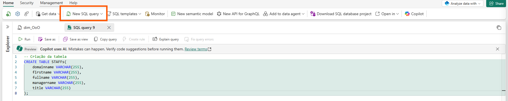

```sql
CREATE TABLE STAFFs (
    domainname VARCHAR(255),
    firstname VARCHAR(255),
    fullname VARCHAR(255),
    managername VARCHAR(255),
    title VARCHAR(255)
);

CREATE TABLE fOoO (
    Id VARCHAR(32) NOT NULL,
    Employee VARCHAR(255) NOT NULL,
    Type VARCHAR(255) NOT NULL,
    StartDate DATE NOT NULL,
    EndDate DATE NOT NULL
);

CREATE TABLE dim_OoO (
    Type VARCHAR(255) NOT NULL,
    Id INT
);

-- Inserção dos dados de dimensão
INSERT INTO dim_OoO (Type, Id) VALUES
('Vacation', 1),
('HHTO', 2),
('License', 3),
('OoO', 4);
```

---

## Etapa 2 - Criação das Funções de Dados do Usuário (FDU)

As Funções de Dados do Usuário são funções Python reutilizáveis que podem ser invocadas entre o Microsoft Fabric e aplicativos externos. Elas oferecem um ambiente de computação sem servidor para hospedar e executar códigos diretamente no Fabric.

📖 [Documentação oficial sobre FDU](https://learn.microsoft.com/pt-br/fabric/data-engineering/user-data-functions/user-data-functions-overview)


**1.** Dentro do Workspace do Fabric, crie uma nova FDU:

> **Workspace** → **Novo Item** → **Função de Dados do Usuário** → Inserir Nome

📖 [Como criar FDU no portal](https://learn.microsoft.com/pt-br/fabric/data-engineering/user-data-functions/create-user-data-functions-portal)

**2.** Com a função criada, clique em **Nova Função** e em seguida clique em **Configurar Conexões**:

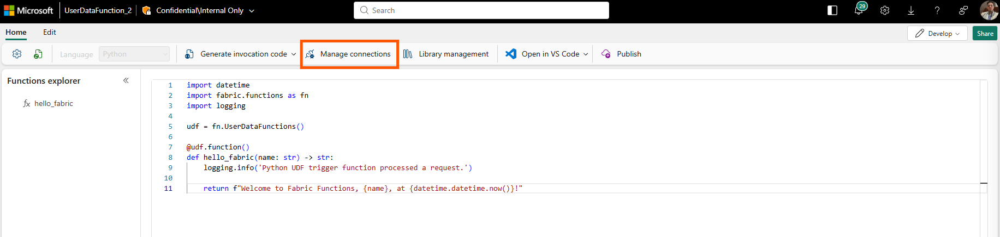

**3.** Em Configurar Conexões, adicione a conexão ao Warehouse criado anteriormente:

> **Configurar Conexões** → **Adicionar Conexão** → Selecionar o Warehouse

Selecione a conexão criada e clique no ícone de lápis para editá-la:

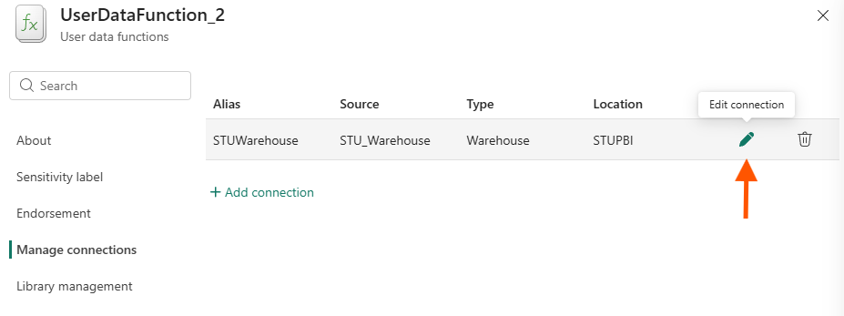

No campo **Alias**, substitua o valor por `MyWarehouse` e clique em **Update**:

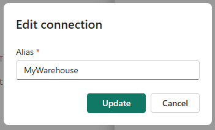

Feche o painel de conexões.

**4.** Substitua o código padrão pelo código abaixo:

> ⚠️ No campo `warehouse_name`, insira o nome do seu banco de dados.

```python
import fabric.functions as fn
import re
import time
import random

udf = fn.UserDataFunctions()

# Insira o nome do banco de dados
warehouse_name = ""


def uuid_v7():
    """Gera um ID único baseado em timestamp para cada operação."""
    timestamp_ms = int(time.time() * 1000)
    rand_bits = random.getrandbits(74)

    return (
        f"{timestamp_ms:012x}"
        f"{rand_bits:018x}"
    )


@udf.connection(argName="myWarehouse", alias="MyWarehouse")
@udf.function()
def inserte_OoO(myWarehouse: fn.FabricSqlConnection, employee: str, ftype: str, startdate: str, enddate: str) -> str:
    """Insere um registro de ausência no Warehouse."""

    id_gerado = uuid_v7()
    connection = myWarehouse.connect()
    cursor = connection.cursor()
    cursor.execute(f"USE [{warehouse_name}]")
    message = ""

    try:
        query = f"INSERT INTO [{warehouse_name}].[dbo].[fOoO] (Id, Employee, Type, StartDate, EndDate) VALUES (?, ?, ?, ?, ?)"
        cursor.execute(query, id_gerado, employee, ftype, startdate, enddate)
        message = "OoO Inserted"
    except Exception as e:
        message = f"Erro ao processar: {e}"

    connection.commit()
    cursor.close()
    connection.close()

    return message


@udf.connection(argName="myWarehouse", alias="MyWarehouse")
@udf.function()
def delete_OoO(myWarehouse: fn.FabricSqlConnection, employee: str, dateids: str) -> str:
    """Remove registros de ausência do Warehouse."""

    itens = re.findall(r"'(.*?)'", dateids)
    connection = myWarehouse.connect()
    cursor = connection.cursor()
    cursor.execute(f"USE [{warehouse_name}]")
    message = ""

    for i in itens:
        try:
            query = f"DELETE FROM [{warehouse_name}].[dbo].[fOoO] WHERE Employee = ? AND Id = ?"
            cursor.execute(query, employee, i)
            message = "OoO Deleted"
        except Exception as e:
            message = f"Erro ao processar: {e}"
            continue

    connection.commit()
    cursor.close()
    connection.close()

    return message
```
📄 [Código documentado da função](Codes/data_function_pt-br.py)
---

## Etapa 3 - Teste das Funções

**1.** Na barra lateral direita, no **Explorador de Funções**, selecione a função `inserte_OoO` e clique no ícone de teste:

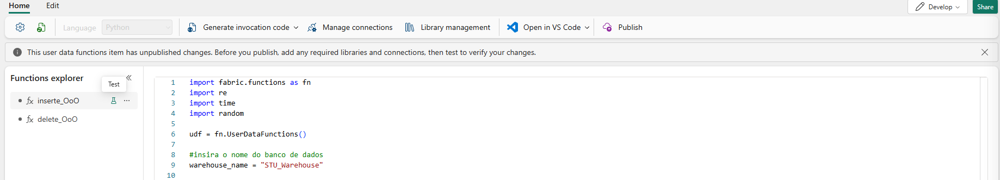

**2.** Insira valores para teste:

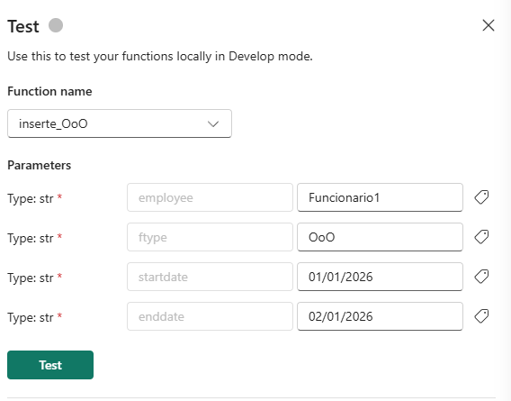

| Parâmetro | Valor de Exemplo |
|-----------|-----------------|
| `employee` | Funcionario1 |
| `ftype` | OoO |
| `startdate` | 2026-01-01 |
| `enddate` | 2026-01-02 |

**3.** Clique em **Testar** e aguarde a execução.

**4.** Com o resultado de sucesso, volte ao Warehouse e execute a query abaixo para confirmar a inserção:

```sql
SELECT * FROM fOoO;
```

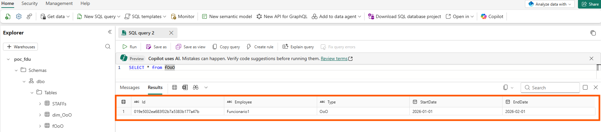

---

## Etapa 4 - Publicação da Função

Dentro da Função de Dados do Usuário, clique em **Publicar** para disponibilizá-la como aplicação:

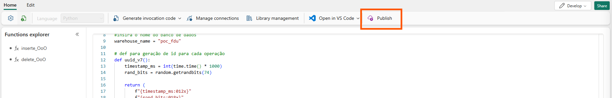

---

## Etapa 5 - Conexão das bases com o Power BI

**1.** Volte ao Warehouse e clique no ícone de engrenagem para obter a **string de conexão SQL**:

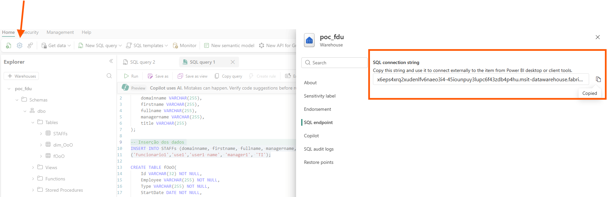

**2.** No Power BI Desktop, abra o arquivo [`OoO_Dash.pbix`](pbi_file/OoO_Dash.pbix) e vá em **Transformar Dados**.

**3.** Cole a string SQL no parâmetro `warehouse_endpoint` e insira o nome do banco em `warehouse_name`:

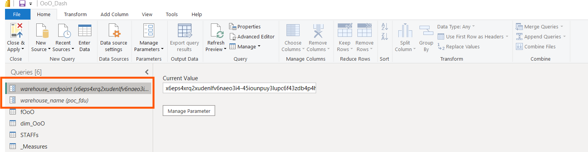

**4.** Clique em **Fechar & Aplicar** e atualize o modelo semântico de dados.

---

## Etapa 6 - Conectar Função de Dados do Usuário com o Power BI

### 6.1 - Salvar Dados

Na página inicial do dashboard, selecione o botão **"Save OoO"** e vá para a aba de **Ações**:

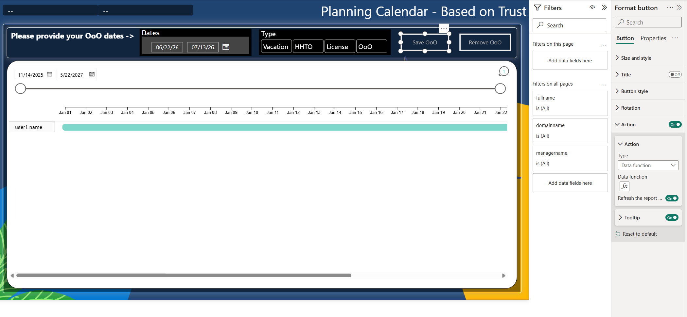

Na aba de ações, em **Tipo**, selecione **Função de Dados**. Clique no ícone **fx** para selecionar a função `inserte_OoO` e clique em **Conectar**:

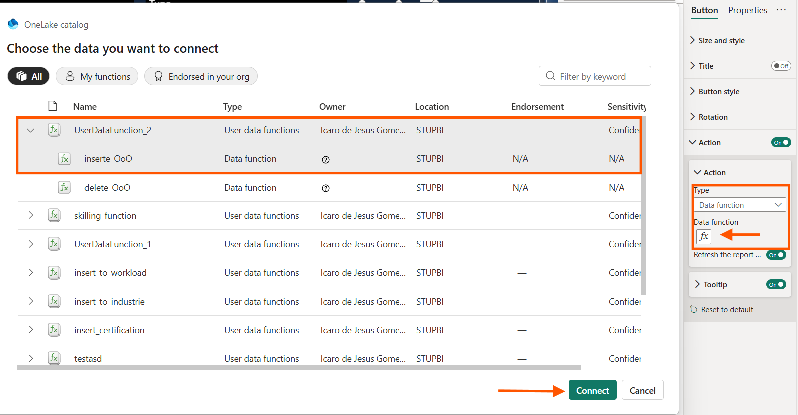

Preencha os campos conforme abaixo:

| Campo | Configuração |
|-------|-------------|
| `Employee` | Clique em **fx** → selecione a medida `Connected User` |
| `ftype` | Clique na barra de opções → selecione `Type` + ative **Limpar Automático** |
| `startdate` | Clique em **fx** → selecione a medida `Start Date` |
| `enddate` | Clique em **fx** → selecione a medida `End Date` |

Com os campos preenchidos, selecione uma data, um tipo de ausência e clique em **Salvar**. Os dados aparecerão no gráfico de Gantt do dashboard.

### 6.2 - Deletar Dados

Selecione o item **"Remove OoO"** e vá para **Actions**. Selecione a Função de Dados `delete_OoO`:

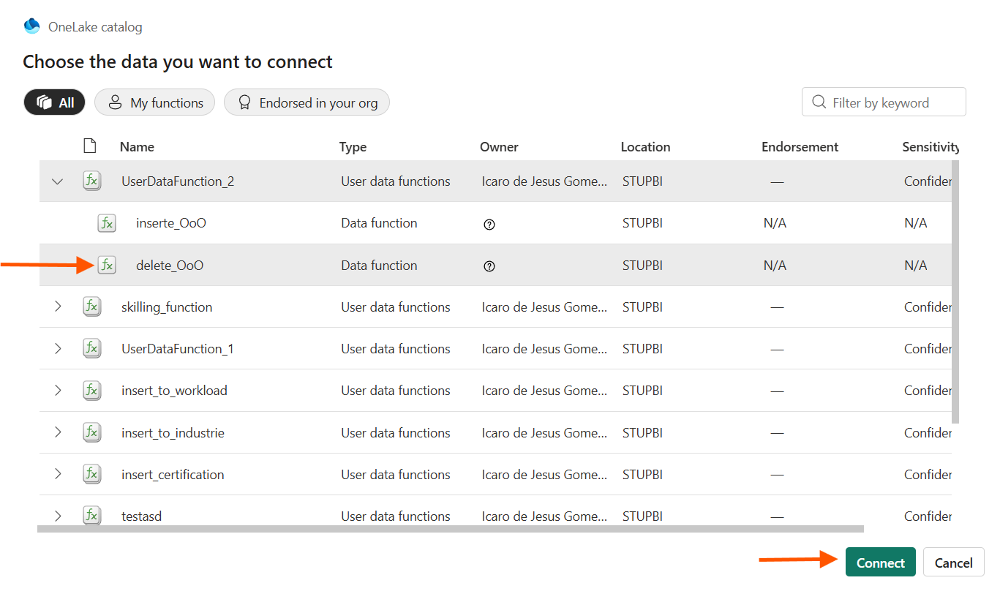

Preencha os campos:

| Campo | Configuração |
|-------|-------------|
| `employee` | Clique em **fx** → selecione a medida `Connected User` |
| `dateids` | Clique em **fx** → selecione a medida `Delete Date` |

Agora você pode clicar em qualquer parte do gráfico de calendário, selecionar uma data e clicar em **Remove OoO** para eliminar os dados do banco.

**Resultado final:**


---

## Etapa 7 - Modelo de Dados

Na aba de **Visualização de Modelo** no Power BI, você encontrará as tabelas conectadas em formato de armazenamento misto:

- **4 tabelas em Import** (dimensões)
- **1 tabela em Direct Query** (tabela fato — linha azul no topo)

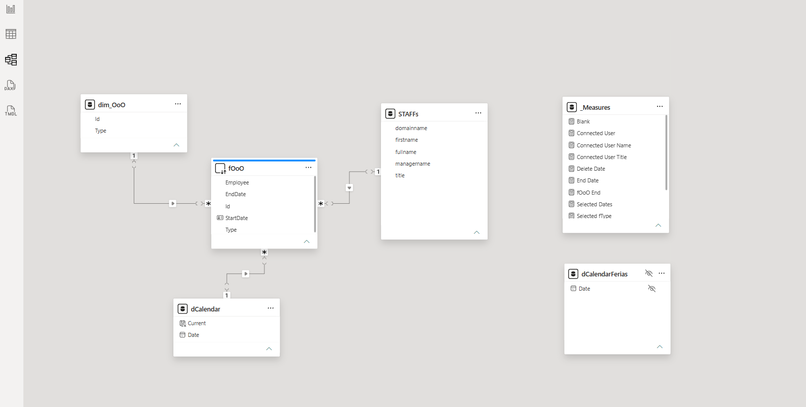

A tabela fato `fOoO` está em **Direct Query** porque recebe dados novos constantemente, exigindo uma conexão em tempo real.

As demais tabelas (dimensões) podem permanecer em **Import** pois não recebem dados frequentemente.

> ⚠️ **IMPORTANTE:** As tabelas em formato Import devem estar configuradas para **não atualizar** junto com o modelo semântico. Caso contrário, toda execução da função forçará uma atualização desnecessária dessas tabelas.

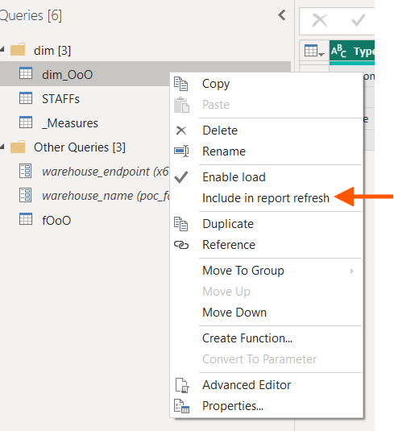

### Row Level Security (RLS)

O dashboard possui **RLS (Row Level Security)** que permite que cada usuário visualize somente os dados atrelados ao seu gerente, utilizando como base a tabela `STAFFs`.

Para visualizar o RLS:

> **Modelagem** → **Gerenciar Funções** (Manage Roles)

---

## Etapa 8 - Publicação do Dashboard

Clique em **Publicar** e selecione o workspace que hospedará o Power BI.

Para compartilhar o dashboard com outros usuários, configure os seguintes acessos:

| Recurso | Permissão Necessária |
|---------|---------------------|
| Report do Power BI | Compartilhar com os usuários |
| Modelo Semântico | Acesso de leitura ao modelo |
| Warehouse | Acesso de leitura |
| Função de Dados do Usuário | Acesso de leitura e execução |

---

## Etapa 9 - Atualização dos dados no formato Import

Como desativamos a atualização automática das tabelas em formato Import (Etapa 7), é necessário criar um **Pipeline do Fabric** para atualizá-las manualmente quando houver alterações nos dados de dimensão.

**1.** No workspace, crie um novo Pipeline:

> **Workspace** → **Novo Item** → **Pipeline de Dados**

**2.** Dentro do Pipeline, na aba superior, vá em **Atividades** e selecione **"Atualização de modelo semântico"**:

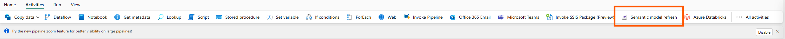

**3.** Clique no item adicionado e vá em **Configurações** → **Conexão**. Faça a autenticação com seu usuário:

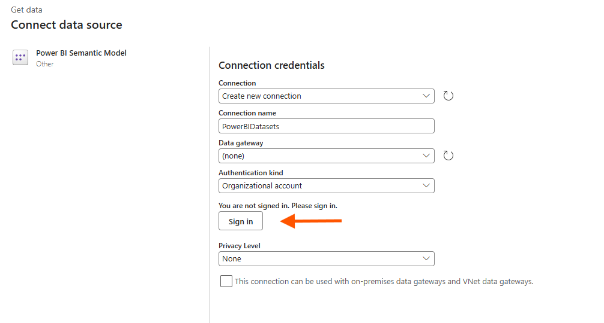

**4.** Abaixo de Conexão, selecione o **Workspace** onde o modelo semântico foi publicado. Em seguida, selecione o **relatório do Power BI** publicado anteriormente.

**5.** Em **Tables**, selecione apenas as tabelas que estão no formato **Import**:

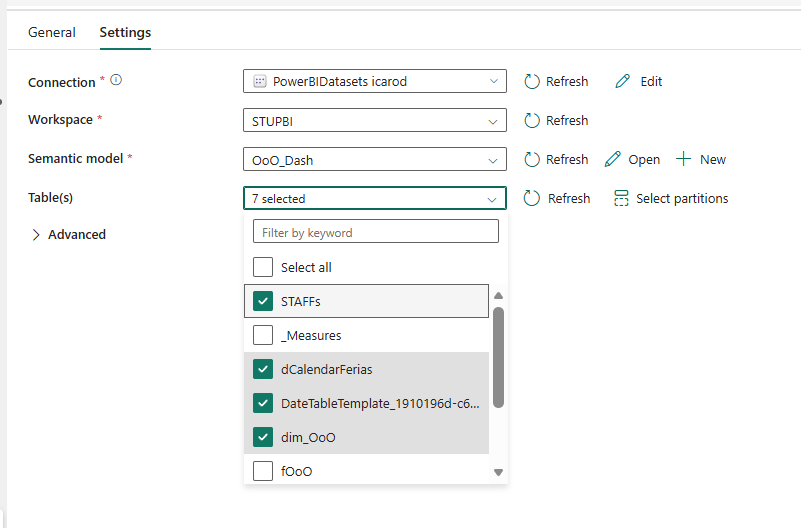

**6.** Clique em **Salvar** e execute o Pipeline sempre que precisar atualizar os dados das tabelas em Import.

> 💡 **Dica:** Você também pode agendar a execução do Pipeline para rodar automaticamente em intervalos regulares.

---
## Referências

- [Visão geral das Funções de Dados do Usuário](https://learn.microsoft.com/pt-br/fabric/data-engineering/user-data-functions/user-data-functions-overview)
- [Criar Funções de Dados do Usuário no portal](https://learn.microsoft.com/pt-br/fabric/data-engineering/user-data-functions/create-user-data-functions-portal)
- [Comprar capacidade do Fabric](https://learn.microsoft.com/pt-br/fabric/enterprise/buy-subscription)
- [Criar workspaces no Fabric](https://learn.microsoft.com/pt-br/fabric/fundamentals/create-workspaces)


