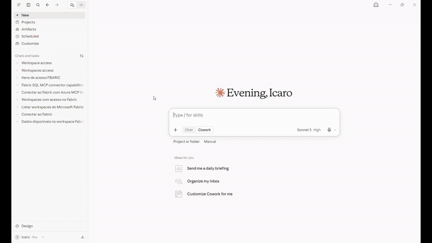
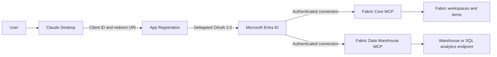

# Claude Desktop + Microsoft Fabric MCP

Guia prático para conectar o Claude Desktop aos servidores MCP oficiais do
Microsoft Fabric.

Practical guide for connecting Claude Desktop to the official Microsoft Fabric
MCP servers.

> [!IMPORTANT]
> Os servidores MCP apresentados estão em preview. Endpoints, ferramentas e
> requisitos de permissão podem mudar antes da disponibilidade geral.
>
> The MCP servers shown here are in preview. Endpoints, tools, and permission
> requirements may change before general availability.

## Demonstração | Demo

[](./assets/demo/claude-fabric-demo.mp4)

**[Assistir ao vídeo completo em MP4 (50 segundos)](./assets/demo/claude-fabric-demo.mp4)**
|
**[Watch the full MP4 video (50 seconds)](./assets/demo/claude-fabric-demo.mp4)**

Na demonstração, o Claude:

1. usa o **Fabric Core MCP** para listar os workspaces disponíveis;
2. identifica os itens de um workspace;
3. usa o **Fabric Data Warehouse MCP** para executar T-SQL;
4. resume o contexto e as tabelas de um Lakehouse.

In the demo, Claude:

1. uses **Fabric Core MCP** to list the available workspaces;
2. identifies the items in a workspace;
3. uses **Fabric Data Warehouse MCP** to run T-SQL;
4. summarizes the context and tables in a Lakehouse.

## Escolha o idioma | Choose your language

| Idioma / Language | Documentação / Documentation |
| --- | --- |
| Português (Brasil) | **[Abrir o guia passo a passo](./docs/pt-BR.md)** |
| English (United States) | **[Open the step-by-step guide](./docs/en-US.md)** |

## O que você aprenderá | What you will learn

- criar um App Registration no Microsoft Entra ID;
- configurar o redirect URI exigido pelo Claude Desktop;
- adicionar permissões delegadas para o Microsoft Fabric;
- conectar os servidores remotos Fabric Core MCP e Fabric Data Warehouse MCP;
- validar a identidade utilizada nas consultas;
- aplicar recomendações de menor privilégio, segurança e RLS;
- diagnosticar erros comuns de autenticação e autorização.

The guides cover the same end-to-end flow in English, including app
registration, delegated OAuth, connector setup, validation, least privilege,
RLS, and troubleshooting.

## Arquitetura | Architecture



O Claude usa o client ID, o redirect URI e os escopos definidos no App
Registration para iniciar a autenticação no Microsoft Entra ID. Depois do login
e consentimento, o contexto autenticado se divide em duas conexões: uma com o
Fabric Core MCP e outra com o Fabric Data Warehouse MCP. As operações no Fabric
usam as permissões do usuário conectado.

Claude uses the client ID, redirect URI, and scopes defined in the App
Registration to start authentication with Microsoft Entra ID. After sign-in and
consent, the authenticated flow branches into two connections: Fabric Core MCP
and Fabric Data Warehouse MCP. Fabric operations use the signed-in user's
permissions.

No client secret is required for this public-client flow.

## Estrutura do projeto | Project structure

```text
.
|-- README.md
|-- assets/
|   `-- demo/
|       |-- claude-fabric-demo-preview.gif
|       `-- claude-fabric-demo.mp4
`-- docs/
    |-- en-US.md
    `-- pt-BR.md
```

## Começar | Get started

- [Seguir o tutorial em português](./docs/pt-BR.md)
- [Follow the tutorial in English](./docs/en-US.md)
