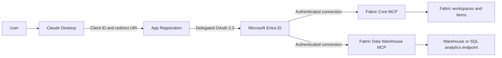

# Connect Claude Desktop to Microsoft Fabric using MCP

[Project home](../README.md) | [Português (Brasil)](./pt-BR.md)

> Prefer to see the result first? [Watch the 50-second demo](../assets/demo/claude-fabric-demo.mp4).

This guide explains how to connect Claude Desktop to two official remote
Microsoft Fabric MCP servers:

| Server | Purpose | Endpoint |
| --- | --- | --- |
| Fabric Core MCP | Discover and manage Fabric workspaces and items | `https://api.fabric.microsoft.com/v1/mcp/core` |
| Fabric Data Warehouse MCP | Run T-SQL against Warehouses and SQL analytics endpoints | `https://api.fabric.microsoft.com/v1/mcp/dataPlane/sqlEndpoint` |

> [!IMPORTANT]
> The MCP servers described in this guide are in preview. Endpoints, tools, and
> permission requirements might change before general availability.

## Architecture and identity



The App Registration stored in Microsoft Entra ID defines the **OAuth client**:
its client ID, redirect URI, and delegated scopes. Claude uses that
configuration to start Microsoft sign-in. After authentication, the authorized
flow branches into two connections: Fabric Core MCP and Fabric Data Warehouse
MCP.

The App Registration does not replace the user's identity. Queries run as the
person who completed Microsoft sign-in.

Effective access is the intersection of:

1. delegated permissions consented for the app registration;
2. the user's Fabric workspace and item permissions;
3. SQL permissions;
4. database security policies, including RLS.

## Prerequisites

- Claude Desktop or Claude access that supports custom connectors;
- a Microsoft Entra ID work or school account;
- permission to create an app registration, or assistance from an
  administrator;
- access to the target workspace and Warehouse or SQL analytics endpoint;
- administrator consent when required by the tenant's consent policy.

## 1. Create the app registration

1. Open the [Microsoft Entra admin center](https://entra.microsoft.com).
2. Go to **Identity** > **Applications** > **App registrations**.
3. Select **New registration**.
4. Enter a name, for example:

   ```text
   Fabric MCP - Claude Desktop
   ```

5. Under **Supported account types**, select:

   ```text
   Accounts in this organizational directory only (Single tenant)
   ```

6. Leave **Redirect URI** empty for now.
7. Select **Register**.
8. On the **Overview** page, copy the **Application (client) ID**.

> [!NOTE]
> Use the **Application (client) ID**, not the Object ID. A client ID is not a
> secret.

## 2. Configure the Claude redirect URI

1. Open **Authentication** in the app registration.
2. Select **Add a platform**.
3. Choose **Mobile and desktop applications**.
4. Add this exact URI:

   ```text
   https://claude.ai/api/mcp/auth_callback
   ```

5. Save the configuration.
6. Under **Advanced settings**, leave **Allow public client flows** set to `No`
   unless another application using the same registration explicitly requires
   that flow.

Do not create or provide a client secret for this connection. Claude uses a
public client with interactive sign-in.

## 3. Add delegated permissions

In the app registration:

1. Open **API permissions**.
2. Select **Add a permission**.
3. Choose **Power BI Service**.
4. Select **Delegated permissions**.

### Required Warehouse MCP permissions

Add:

```text
Item.ReadWrite.All
Item.Execute.All
```

The current endpoint validates both permissions during authorization, even
when the intended workload only runs `SELECT` statements.

Without `Item.ReadWrite.All`, the endpoint can return:

```text
Required scopes: Item.ReadWrite.All and Item.Execute.All
```

After adding the permissions:

1. select **Add permissions**;
2. select **Grant admin consent** if required;
3. verify that both permissions show a granted consent status.

> [!WARNING]
> `Item.ReadWrite.All` is broad. Because it is delegated, the application
> remains constrained by the signed-in user's access. Even so, use an
> item-scoped endpoint, limit user permissions, and keep manual approval for
> SQL tool calls.

### Fabric Core MCP permissions

Core permissions depend on the tools you use. Apply least privilege and add
only the required scopes, for example:

```text
Workspace.Read.All
Item.Read.All
```

Create, update, or execute operations require additional scopes. For
production, consider separate app registrations for Core and Warehouse.

## 4. Choose a Warehouse endpoint

### Global endpoint

Use this endpoint to select different items during a conversation:

```text
https://api.fabric.microsoft.com/v1/mcp/dataPlane/sqlEndpoint
```

### Item-scoped endpoint

This option is recommended when Claude should access one specific Warehouse or
SQL analytics endpoint:

```text
https://api.fabric.microsoft.com/v1/mcp/dataPlane/workspaces/{workspace-id}/items/{item-id}/sqlEndpoint
```

Replace:

- `{workspace-id}` with the workspace ID;
- `{item-id}` with the Warehouse or **SQL analytics endpoint** ID.

> [!CAUTION]
> For a Lakehouse, use the associated SQL analytics endpoint ID, which is not
> necessarily the Lakehouse item ID.

The workspace ID appears in the Fabric portal URL after `/groups/`. To list
SQL analytics endpoints and their IDs, use:

```http
GET https://api.fabric.microsoft.com/v1/workspaces/{workspace-id}/sqlEndpoints
```

## 5. Add the connectors to Claude

In Claude Desktop:

1. Open **Settings** > **Connectors**.
2. Select **Add custom connector**.
3. Enter the server name and URL.
4. For authentication, choose the option to use your own OAuth client.
5. Enter the **Application (client) ID** you created.
6. Do not enter a client secret.
7. Save and select **Connect**.
8. Complete Microsoft sign-in.

### Fabric Core MCP

```text
Name: Fabric Core MCP
Remote MCP server URL: https://api.fabric.microsoft.com/v1/mcp/core
OAuth Client ID: <application-client-id>
```

### Fabric Data Warehouse MCP

```text
Name: Fabric Warehouse MCP
Remote MCP server URL: <global-or-item-scoped-endpoint>
OAuth Client ID: <application-client-id>
```

On Claude Team or Enterprise plans, an Owner might need to add the connector
to the organization before individual users can connect their accounts.

## 6. Validate the connection

### Confirm the SQL identity

Ask Claude:

```text
Use Fabric Warehouse MCP and run only:

SELECT
    USER_NAME() AS execution_user,
    CURRENT_USER AS current_user;
```

The result should identify the user who completed Microsoft sign-in, not the
app registration name.

### List tables

```text
Show the T-SQL before execution. Use SELECT only to list the available schemas,
tables, and views through INFORMATION_SCHEMA.TABLES.
```

Expected query:

```sql
SELECT
    TABLE_SCHEMA,
    TABLE_NAME,
    TABLE_TYPE
FROM INFORMATION_SCHEMA.TABLES
ORDER BY TABLE_SCHEMA, TABLE_NAME;
```

The tool name might appear as `executeSQL` or `execute_query`, depending on the
deployed server version.

## Security and RLS

Warehouse MCP uses the signed-in user's identity and respects Fabric and SQL
permissions. An RLS policy created in the Warehouse or SQL analytics endpoint
is enforced for queries submitted through Claude.

Example identity-based predicate:

```sql
WHERE @User = USER_NAME()
```

RLS configured only in a Power BI semantic model does not protect direct T-SQL
queries. Configure RLS in the Warehouse or SQL analytics endpoint for this
access path.

Recommendations:

- prefer an item-scoped endpoint;
- use an identity that can access only the required data;
- grant only the required SQL permissions;
- keep manual confirmation enabled for tool calls;
- ask Claude to show T-SQL before execution;
- monitor Warehouse audit logs;
- use separate app registrations for integrations with different purposes.

## Fabric Admin portal configuration

The delegated Warehouse MCP flow does not currently require a dedicated Fabric
Admin portal tenant setting.

You do not need to enable:

- **Service principals can call/use Fabric APIs**, because this flow does not
  use application-only authentication;
- the **Power BI MCP** tenant setting, which applies to the Power BI endpoint;
- Fabric Data Agent or cross-geo AI processing settings.

The user still needs the appropriate workspace, item, and SQL permissions.

## Troubleshooting

### Sign-in succeeds, but Claude shows `McpAuthorizationError`

Verify that the token contains both:

```text
Item.ReadWrite.All
Item.Execute.All
```

After changing permissions:

1. grant the required consent;
2. allow time for propagation;
3. remove and recreate the connector to avoid a stale cached token.

### `redirect_uri_mismatch` or `AADSTS50011`

Verify the exact redirect URI:

```text
https://claude.ai/api/mcp/auth_callback
```

It must be registered under **Mobile and desktop applications**.

### Core connects, but Warehouse does not

Warehouse has different authorization requirements. Verify
`Item.ReadWrite.All` and `Item.Execute.All`; read-only permissions do not
satisfy the endpoint's current validation.

### A query returns HTTP 403

OAuth succeeded, but the user is missing an effective permission:

- a workspace role or direct item share;
- access to the Warehouse or SQL analytics endpoint;
- `CONNECT`, `SELECT`, or another required SQL permission;
- access allowed by the RLS policy.

### Tables do not appear

- verify that you selected the correct SQL analytics endpoint;
- for a Lakehouse, only compatible Delta tables appear automatically;
- query `INFORMATION_SCHEMA.TABLES`;
- check SQL analytics endpoint metadata synchronization.

## References

- [Fabric Core MCP Server](https://learn.microsoft.com/en-us/rest/api/fabric/articles/mcp-servers/core-remote/get-started-core)
- [Fabric Data Warehouse MCP Server](https://learn.microsoft.com/en-us/fabric/data-warehouse/data-warehouse-mcp-server)
- [Register external MCP clients in Microsoft Entra](https://learn.microsoft.com/en-us/power-bi/developer/mcp/remote-mcp-server-external-clients)
- [Microsoft Fabric REST API scopes](https://learn.microsoft.com/en-us/rest/api/fabric/articles/scopes)
- [RLS in Fabric Data Warehouse](https://learn.microsoft.com/en-us/fabric/data-warehouse/row-level-security)
- [Remote custom connectors in Claude](https://support.claude.com/en/articles/11175166-get-started-with-custom-connectors-using-remote-mcp)
