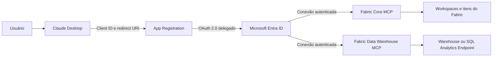

# Conectar o Claude Desktop ao Microsoft Fabric usando MCP

[Página inicial](../README.md) | [English (United States)](./en-US.md)

> Prefere ver o resultado primeiro? [Assista à demonstração de 50 segundos](../assets/demo/claude-fabric-demo.mp4).

Este guia mostra como conectar o Claude Desktop a dois servidores MCP remotos e
oficiais do Microsoft Fabric:

| Servidor | Finalidade | Endpoint |
| --- | --- | --- |
| Fabric Core MCP | Descobrir e administrar workspaces e itens do Fabric | `https://api.fabric.microsoft.com/v1/mcp/core` |
| Fabric Data Warehouse MCP | Executar T-SQL em Warehouses e SQL Analytics Endpoints | `https://api.fabric.microsoft.com/v1/mcp/dataPlane/sqlEndpoint` |

> [!IMPORTANT]
> Os servidores MCP descritos neste guia estão em preview. Endpoints,
> ferramentas e permissões podem mudar antes da disponibilidade geral.

## Arquitetura e identidade



O App Registration armazenado no Microsoft Entra ID define o **cliente OAuth**:
client ID, redirect URI e escopos delegados. O Claude usa essa configuração
para iniciar o login Microsoft. Depois da autenticação, o fluxo autorizado se
divide em duas conexões: Fabric Core MCP e Fabric Data Warehouse MCP.

O App Registration não substitui a identidade do usuário. As consultas são
executadas com a identidade da pessoa que concluiu o login Microsoft.

O acesso efetivo é a interseção de:

1. permissões delegadas consentidas para o App Registration;
2. permissões do usuário no workspace e no item Fabric;
3. permissões SQL;
4. políticas de segurança do banco, incluindo RLS.

## Pré-requisitos

- Claude Desktop ou acesso ao Claude com suporte a custom connectors;
- conta corporativa ou educacional do Microsoft Entra ID;
- permissão para criar um App Registration ou auxílio de um administrador;
- acesso ao workspace e ao Warehouse ou SQL Analytics Endpoint;
- consentimento administrativo para as permissões, quando exigido pela política
  do tenant.

## 1. Criar o App Registration

1. Acesse o [Microsoft Entra admin center](https://entra.microsoft.com).
2. Vá para **Identity** > **Applications** > **App registrations**.
3. Selecione **New registration**.
4. Informe um nome, por exemplo:

   ```text
   Fabric MCP - Claude Desktop
   ```

5. Em **Supported account types**, selecione:

   ```text
   Accounts in this organizational directory only (Single tenant)
   ```

6. Deixe **Redirect URI** vazio por enquanto.
7. Selecione **Register**.
8. Na página **Overview**, copie o **Application (client) ID**.

> [!NOTE]
> Use o **Application (client) ID**, não o Object ID. O client ID não é um
> segredo.

## 2. Configurar o redirect URI do Claude

1. No App Registration, abra **Authentication**.
2. Selecione **Add a platform**.
3. Escolha **Mobile and desktop applications**.
4. Adicione exatamente:

   ```text
   https://claude.ai/api/mcp/auth_callback
   ```

5. Salve a configuração.
6. Em **Advanced settings**, mantenha **Allow public client flows** como `No`,
   salvo se outra aplicação utilizada com o mesmo registro exigir esse fluxo.

Não crie nem informe um client secret para essa conexão. O Claude usa um
cliente público com login interativo.

## 3. Adicionar as permissões delegadas

No App Registration:

1. Abra **API permissions**.
2. Selecione **Add a permission**.
3. Escolha **Power BI Service**.
4. Selecione **Delegated permissions**.

### Permissões obrigatórias para o Warehouse MCP

Adicione:

```text
Item.ReadWrite.All
Item.Execute.All
```

Na versão atual do endpoint, as duas permissões são validadas durante a
autenticação, inclusive quando o objetivo é executar apenas `SELECT`.

Sem `Item.ReadWrite.All`, o endpoint pode responder:

```text
Required scopes: Item.ReadWrite.All and Item.Execute.All
```

Depois de adicionar as permissões:

1. selecione **Add permissions**;
2. selecione **Grant admin consent**, se exigido;
3. confirme que ambas aparecem com status de consentimento concedido.

> [!WARNING]
> `Item.ReadWrite.All` é uma permissão ampla. Como ela é delegada, a aplicação
> continua limitada ao acesso do usuário conectado. Mesmo assim, use um
> endpoint item-scoped, limite as permissões do usuário e mantenha aprovação
> manual das chamadas SQL.

### Permissões para o Core MCP

As permissões do Core variam conforme as ferramentas utilizadas. Aplique menor
privilégio e adicione apenas os escopos necessários, por exemplo:

```text
Workspace.Read.All
Item.Read.All
```

Operações de criação, alteração ou execução exigem escopos adicionais. Para
produção, considere usar App Registrations separados para Core e Warehouse.

## 4. Escolher o endpoint do Warehouse

### Endpoint global

Permite selecionar diferentes itens durante a conversa:

```text
https://api.fabric.microsoft.com/v1/mcp/dataPlane/sqlEndpoint
```

### Endpoint vinculado a um item

Recomendado quando o Claude deve acessar somente um Warehouse ou SQL Analytics
Endpoint específico:

```text
https://api.fabric.microsoft.com/v1/mcp/dataPlane/workspaces/{workspace-id}/items/{item-id}/sqlEndpoint
```

Substitua:

- `{workspace-id}` pelo ID do workspace;
- `{item-id}` pelo ID do Warehouse ou do **SQL Analytics Endpoint**.

> [!CAUTION]
> Para um Lakehouse, utilize o ID do SQL Analytics Endpoint associado, não
> necessariamente o ID do próprio Lakehouse.

O workspace ID aparece na URL do portal após `/groups/`. Para listar os SQL
Analytics Endpoints e seus IDs, use a API:

```http
GET https://api.fabric.microsoft.com/v1/workspaces/{workspace-id}/sqlEndpoints
```

## 5. Adicionar os conectores no Claude

No Claude Desktop:

1. Abra **Settings** > **Connectors**.
2. Selecione **Add custom connector**.
3. Informe o nome e a URL do servidor.
4. Em autenticação, selecione a opção para usar seu próprio OAuth Client.
5. Informe o **Application (client) ID** criado anteriormente.
6. Não informe client secret.
7. Salve e selecione **Connect**.
8. Conclua o login com sua conta Microsoft.

### Fabric Core MCP

```text
Name: Fabric Core MCP
Remote MCP server URL: https://api.fabric.microsoft.com/v1/mcp/core
OAuth Client ID: <application-client-id>
```

### Fabric Data Warehouse MCP

```text
Name: Fabric Warehouse MCP
Remote MCP server URL: <endpoint-global-ou-item-scoped>
OAuth Client ID: <application-client-id>
```

Em planos Claude Team ou Enterprise, um Owner pode precisar cadastrar o
conector para a organização antes que os usuários possam conectar suas contas.

## 6. Validar a conexão

### Confirmar a identidade SQL

Solicite ao Claude:

```text
Use o Fabric Warehouse MCP e execute somente:

SELECT
    USER_NAME() AS usuario_execucao,
    CURRENT_USER AS usuario_atual;
```

O resultado deve identificar o usuário que concluiu o login Microsoft, não o
nome do App Registration.

### Listar tabelas

```text
Mostre o T-SQL antes de executar. Use apenas SELECT para listar os schemas,
tabelas e views disponíveis por meio de INFORMATION_SCHEMA.TABLES.
```

Consulta esperada:

```sql
SELECT
    TABLE_SCHEMA,
    TABLE_NAME,
    TABLE_TYPE
FROM INFORMATION_SCHEMA.TABLES
ORDER BY TABLE_SCHEMA, TABLE_NAME;
```

O nome da ferramenta pode aparecer como `executeSQL` ou `execute_query`,
dependendo da versão implantada do servidor.

## Segurança e RLS

O Warehouse MCP usa a identidade do usuário conectado e respeita as permissões
do Fabric e do SQL. Uma política RLS criada no Warehouse ou SQL Analytics
Endpoint é aplicada às consultas feitas pelo Claude.

Exemplo de predicado baseado na identidade:

```sql
WHERE @Usuario = USER_NAME()
```

RLS configurada somente em um modelo semântico do Power BI não protege
consultas T-SQL diretas. Para esse caminho, configure RLS no Warehouse ou SQL
Analytics Endpoint.

Recomendações:

- prefira o endpoint item-scoped;
- use uma identidade com acesso somente aos dados necessários;
- conceda apenas permissões SQL necessárias;
- mantenha confirmação manual para chamadas de ferramentas;
- peça ao Claude para mostrar o T-SQL antes da execução;
- monitore logs de auditoria do Warehouse;
- use App Registrations separados para integrações com finalidades diferentes.

## Configuração no Fabric Admin Portal

O fluxo delegado do Warehouse MCP não exige atualmente um tenant setting
específico no Fabric Admin Portal.

Não é necessário habilitar:

- **Service principals can call/use Fabric APIs**, pois a consulta não usa
  autenticação application-only;
- o tenant setting do **Power BI MCP**, que se aplica ao endpoint Power BI;
- configurações de Fabric Data Agent ou processamento de IA cross-geo.

O usuário ainda precisa de acesso ao workspace/item e das permissões SQL
adequadas.

## Solução de problemas

### O login termina, mas o Claude mostra `McpAuthorizationError`

Verifique se o token possui simultaneamente:

```text
Item.ReadWrite.All
Item.Execute.All
```

Depois de alterar permissões:

1. conceda o consentimento necessário;
2. aguarde a propagação;
3. remova e recrie o conector para evitar token antigo em cache.

### `redirect_uri_mismatch` ou `AADSTS50011`

Confirme o redirect URI exato:

```text
https://claude.ai/api/mcp/auth_callback
```

Ele deve estar cadastrado em **Mobile and desktop applications**.

### O Core conecta, mas o Warehouse não

O Warehouse possui requisitos de autorização diferentes. Confirme
`Item.ReadWrite.All` e `Item.Execute.All`; permissões somente de leitura não
são suficientes para a validação atual do endpoint.

### Erro 403 ao executar uma consulta

O OAuth foi concluído, mas o usuário não possui uma das permissões efetivas:

- papel ou compartilhamento no workspace/item;
- acesso ao Warehouse ou SQL Analytics Endpoint;
- `CONNECT`/`SELECT` ou outra permissão SQL necessária;
- acesso permitido pela política RLS.

### Tabelas não aparecem

- confirme que está usando o SQL Analytics Endpoint correto;
- no Lakehouse, somente tabelas Delta compatíveis aparecem automaticamente;
- consulte `INFORMATION_SCHEMA.TABLES`;
- verifique a sincronização de metadados do SQL Analytics Endpoint.

## Referências

- [Fabric Core MCP Server](https://learn.microsoft.com/en-us/rest/api/fabric/articles/mcp-servers/core-remote/get-started-core)
- [Fabric Data Warehouse MCP Server](https://learn.microsoft.com/en-us/fabric/data-warehouse/data-warehouse-mcp-server)
- [Registrar clientes MCP externos no Microsoft Entra](https://learn.microsoft.com/en-us/power-bi/developer/mcp/remote-mcp-server-external-clients)
- [Escopos das APIs REST do Fabric](https://learn.microsoft.com/en-us/rest/api/fabric/articles/scopes)
- [RLS no Fabric Data Warehouse](https://learn.microsoft.com/en-us/fabric/data-warehouse/row-level-security)
- [Custom connectors remotos no Claude](https://support.claude.com/en/articles/11175166-get-started-with-custom-connectors-using-remote-mcp)
